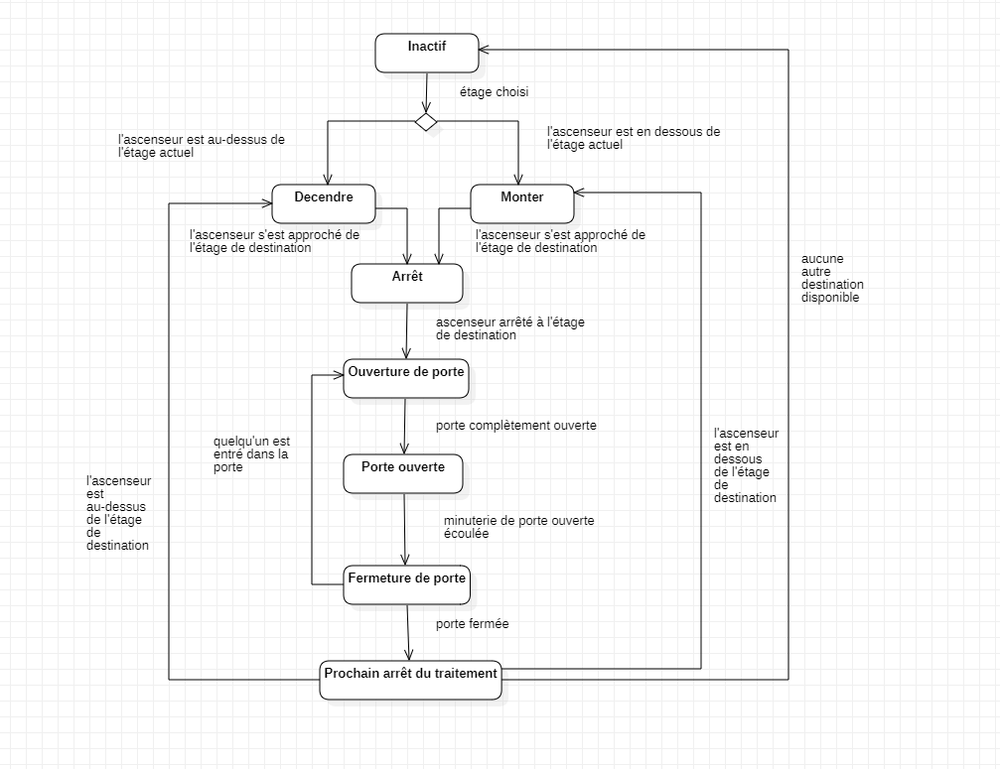
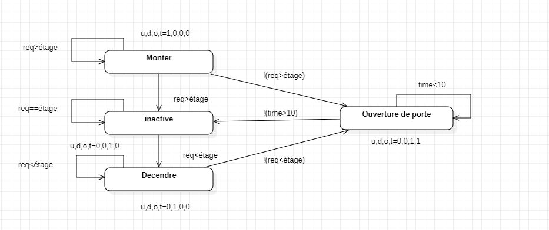

Le diagramme d'état décrit les états suivants d'un ascenseur :
* Inactif
* Descendre
* Monter
* Arrêt
* Ouverture de porte
* Fermeture de porte
* Prochain arrêt du traitement
* Porte ouverte

Le diagramme contient des transitions entre des états particuliers, qui ne peuvent se déclencher que lorsque leur condition est remplie :
* Inactif to Décision - étage choisi
* Décision de descendre - l'ascenseur est au-dessus de l'étage actuel
* Décision de monter - l'ascenseur est en dessous de l'étage actuel
* Descendre jusqu'à l'arrêt - l'ascenseur s'est approché de l'étage de destination
* Déplacement jusqu'à l'arrêt - l'ascenseur s'est approché de l'étage de destination
* Arrêt à l'ouverture de la porte - ascenseur arrêté à l'étage de destination
* Ouverture de la porte pour ouvrir la porte - porte complètement ouverte
* Porte ouverte à la fermeture de la porte - minuterie de porte ouverte écoulée
* Fermeture de la porte à l'ouverture de la porte - quelqu'un est entré dans la porte
* Fermeture de la porte jusqu'au prochain arrêt du traitement - porte fermée
* Prochain arrêt du traitement pour descendre - l'ascenseur est au-dessus de l'étage de destination
* Prochain arrêt du traitement pour remonter - l'ascenseur est en dessous de l'étage de destination
* Prochain arrêt du traitement à inactif - aucune autre destination disponible

